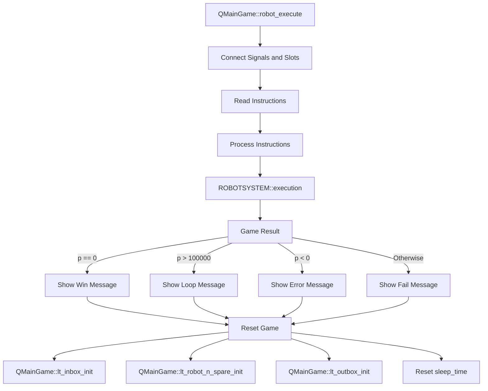
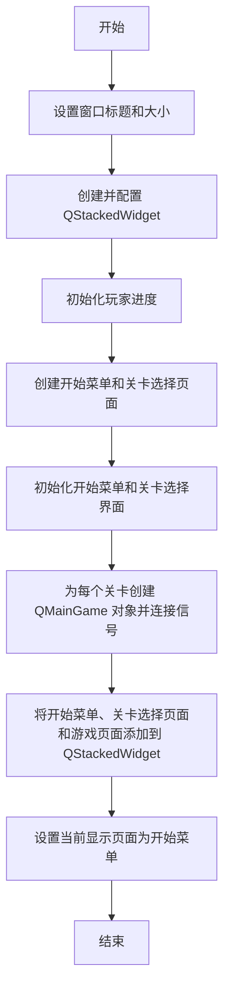
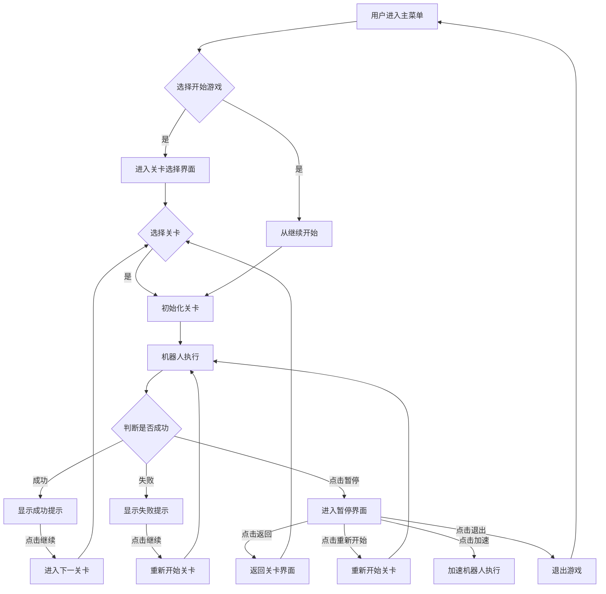

# Human Resource Machine

许越 

王子轩 `2023011307`

### 设计思路

游戏核心功能是模拟机器人系统执行用户编写的指令。基于`Qt6`框架并采用面向对象方法，利用信号与槽机制实现较为便捷的界面交互，将核心逻辑部分和GUI解耦。首先`ROBOTSYSTEM`类在初始化时接收一个`LEVEL`对象，该对象包含了当前关卡的详细信息；然后实现接收用户编写的指令的接口并实现`execution`函数负责执行用户编写的指令，依次调用每个指令对应的函数。在执行每个指令时，`ROBOTSYSTEM`类会发出相应的信号。这些信号会被`QMainGame`类接收，并触发相应的槽函数，如`on_fail_exe`、`on_inbox_exe`、`on_outbox_exe`等。`execution`函数会返回一个整数p，表示游戏的执行结果。如果返回值为0，表示游戏成功；如果返回值为正数，表示程序陷入了死循环；如果返回值为负数，表示在对应的指令上发生了错误。在游戏结束后，`QMainGame`类会重置游戏状并重新初始化游戏界面。

### 项目结构

使用`VisualStudio2022`进行项目构建，GUI基于Qt框架，项目结构如下：

```md
human-resource-machine/
│
├── Header Files/
│   ├── humanresourcemachine.h
│   ├── input_and_output.h
|   ├── progress.h				
│   └── robot_system_generation.h	
│
├── Source Files/
│	└── BasicFunctions
│		├── main.cpp 	
│   	├── input_and_output.h	
|		├── input_and_output.cpp
|		├── robot_system_generation.cpp	
│   	└── robot_system_generation.h			 
│   ├── background_widget.cpp   
│   ├── dialog_pause.cpp
│   ├── dlg_spare.cpp
│   ├── drag_label.cpp
│   ├── drag_list_events.cpp
│   ├── humanresourcemachine.cpp 
|   ├── level_tip_in_game.cpp
│   ├── It_init.cpp
│   ├── main_game_on_pause.cpp	
│   ├── main_game_robot_execute.cpp
│   ├── main_game_robot_move.cpp 
│   ├── robot_system_generation.cpp
│   ├── ui_level_select_init.cpp	
│   ├── ui_main_game_init.cpp
│   └── ui_start_menu_init.cpp 
│
└── Resorce Files/ 				 
```

> oj版本main.cpp：
>
> 首先在`input_and_output.h`的input(string, int*, int*, string[])读取用户通过文件进行的指令输入。初始化关卡LEVEL类和机器人运行系统ROBOTSYSTEM类，通过用户输入的关卡编号，调用LEVEL类的构造函数，进入levels文件夹进行关卡读取，存储到level后再将读取到的关卡通过ROBOTSYSTEM的构造函数写进robot_system中，接下来调用ROBOTSYSTEM::instructions_input(int, string[])将用户的指令写入。完成了输入，调用ROBOTSYSTEM::execution()进行执行，返回0表示成功；返回-x表示在第x行执行时出错，或者用户输入指令为空；返回x表示失败，且运行时执行了x行代码，最后在主函数判断返回值并输出对应结果。
>

### 模块详细介绍

#### `robot_system_generation.cpp`

##### 常量

kMAX_BOX_NUMBER：输入的箱子的最多个数。

kMAX_SPARE_NUMBER：最大空地数量。

kMAX_NUMBER_OF_AVAILABLE_INSTRUCTIONS：最多可用指令。

kMAX_NUMBER_OF_LEVEL：关卡数量。

kMAX_INSTRUCTION_LENGTH：单条指令的最大长度。

##### LEVEL类

> 用于表示游戏的一个关卡，其中包含了积木的初始状态、目标输出、空地数量以及可用的指令集。它有两组构造函数，一个用于从给定的数组初始化关卡数据，另一个用于从文件中读取关卡数据。`LEVEL` 类提供了获取关卡信息的公有方法，如 `get_box_number()`、`get_boxes(int index)`、`get_aim_out_number()`、`get_aim_outs(int index)`、`get_spare_number()`、`get_available_instructions(int index)` 和 `get_available_instruction_number()`。这些方法让允许友元类`ROBOTSYSTEM` 类访问关卡信息，并根据这些信息执行计算的操作。

###### 变量

int boxes[]：输入箱子的值，这里为了读取方便，存储是反过来的

int box_number：输入箱子的个数

int aim_outs：预期输出的箱子

int aim_out_number：预期输出的箱子个数

int spare_number：可用空地数量

string available_instructions[]：可用指令

int available_instruction_number：可用指令数量

###### 函数

>LEVEL(const int boxes_input[], int box_number_input, const int aim_outs_input[], int aim_out_number_input, int spare_number_input, const string available_instructions_input[], int available_instruction_number)：将关卡信息初始化。

LEVEL(string level_path)：读取文件，利用关卡文件初始化关卡。

int get_box_number()：获取box_number。

int get_boxes(int index)：获取boxes[index]。

int get_aim_out_number()：获取aim_out_number。

int get_aim_outs(int index)：获取aim_outs[index]。

int get_spare_number()：获取spare_number。

string get_available_instructions(int index)：获取available_instructions[index]。

int get_available_instruction_number：获取available_instruction_number。

##### ROBOTSYSTEM类

> 模拟机器人执行玩家编写的指令。它的构造函数接收一个 `LEVEL` 对象，根据这个对象初始化机器人系统的状态。`instructions_input` 方法用于接收并解析玩家输入的指令，将它们转换为对应的操作函数和操作数。`execution` 方法是游戏的主执行循环，它循环执行玩家编写的指令，并根据执行结果返回相应的状态码。`ROBOTSYSTEM` 类还定义指令方法，如 `inbox(int)`、`outbox(int)`、`add(int)`、`sub(int)`、`copyto(int)` 和 `copyfrom(int)`，这些方法对应游戏中可以执行的基本操作。

###### 变量

LEVEL* level：存储关卡。

LEVEL* level_saved：存储初始化的关卡，重开时可以刷新。

int spares[]：空地的数值。

bool used_spares[]：空地是否被占用。

int outs[]：输出的盒子的值。

int out_number：输出的盒子数量。

int (ROBOTSYSTEM::*instructions[])(int)：输入的指令作为函数数组的存储。

int instruction_operators[]：每个指令对应一个指令数，如jump的指令数是所要跳转的行数，如果指令本身没有指令数，那就记作-1.

int instruction_number：指令数量。

int robot_number：机器人头顶存储的数字。

bool is_robot_has_number：机器人头顶是否存储数值。

int execute_number：指令执行到的位置。由于有很多跳转逻辑，因此使用一个变量专门存储指令执行到哪里。

###### 函数

ROBOTSYSTEM(LEVEL* l)：将关卡写入运行系统。

int inbox(int)：读取输入的盒子的值，默认输入inbox的参数是-1。这里规定，指令能执行且程序不中止返回1，指令能执行且程序中止（在inbox中是输入盒子已经读完）返回0，指令不能执行返回-1，下同。

int outbox(int)：将机器人头上的盒子输出到outs里。

int add(int)：将机器人头上的值修改为robot_number+spares[op]，其中op是指令数，下同。

int sub(int)：与add相似，相加变成相减。

int copyto(int)：将机器人头上的值赋给空地。

int copyfrom(int)：将空地的值赋给机器人。

int jump(int)：跳到第op行指令。

int jumpifzero(int)：如果机器人头上的值不是0则不跳转，否则跳转到第op行指令。这里根据题意，不管跳转是否发生，如果第op行指令不存在，直接返回-1。

void instructions_input(int, string[])：将用户输入的指令转为int (ROBOTSYSTEM::*)(int)函数类型，存储到instructions函数数组里。

int execution()：运行机器人系统并返回结果，在运行过程中输出信号给图形界面更新。首先删除旧的关卡，因为对其进行了一些修改，在使用level_saved重新初始化level。接着将所有变量全部初始化。之后开始执行运算，首先设int execute_count变量，统计指令一共执行了多少条，接着按指令的跳转逻辑顺序执行指令，并判断是否中止或异常，异常则返回-x，中止则判断是否与aim_outs目标输出一致，一致则返回0，否则返回+x。

#### `main_game_robot_execute.cpp`

连接 `ROBOTSYSTEM` 类的信号与 `QMainGame` 类的槽函数，以便在指令执行过程中能够及时更新游戏界面。从 `QDragListWidget`（一个可拖拽的列表控件）中获取玩家编写的指令，并调用 `ROBOTSYSTEM::instructions_input` 方法将这些指令输入到机器人系统中。然后，它调用 `ROBOTSYSTEM::execution` 方法执行这些指令，并根据执行结果来显示不同的消息框：成功、失败或错误。如果游戏结束（无论是成功还是失败），它都会重置游戏状态，以便玩家可以重新开始。



### `humanresourcemachine.cpp` & `humanresourcemachine.h`

> 和 `humanresourcemachine.h`  中定义了GUI主要的类；`humanresourcemachine.cpp` 文件是 `human-resource-machine` 游戏的图形用户界面（GUI）逻辑的入口和实现部分。

#### humanresourcemachine类

> 游戏的主窗口类，继承自 `QMainWindow`。它包含了游戏的主界面布局、进度管理、关卡选择和游戏执行。

- 构造函数 `humanresourcemachine(QWidget* parent)`：初始化游戏主窗口，设置窗口标题和大小，创建并配置主界面布局和控件。
- 析构函数 `~humanresourcemachine()`：清理资源，如删除进度管理对象。
- `ui_start_menu_init()`：初始化开始菜单界面。
- `ui_level_select_init()`：初始化关卡选择界面。
- `start_game()`：开始新游戏。
- `exit_game()`：退出游戏。
- `start_game_from_continue()`：从上次进度继续游戏。
- `enter_level(int level_num)`：进入指定关卡。
- `exit_level()`：退出当前关卡。
- `show_level_tip(int level_num)`：显示关卡提示。
- `on_game_exit(int level_num, bool completed)`：处理游戏退出事件。
- `update_progress(int p, int level_num)`：更新玩家进度。
- `ui_level_select_re_init()`：重新初始化关卡选择界面。

##### 窗口跳转流程关系



#### QMainGame 类

> 这个类表示游戏的主要游戏界面，包含了一个关卡的所有元素，如输入输出箱、代码区域、机器人状态等。主要函数包括：

- 构造函数 `QMainGame(int level_index, QWidget* parent)`：初始化游戏界面，根据关卡索引创建关卡和机器人系统。
- 各种布局初始化函数，如 `lt_inbox_init`、`lt_outbox_init`、`lt_robot_n_spare_init`、`lt_code_choice_init`、`lt_code_init`、`lt_robot_init`、`lt_space_init` 和 `lt_pause_init`。
- `robot_execute()`：执行玩家编写的代码。
- 信号槽函数，如 `on_fail_exe`、`on_inbox_exe`、`on_outbox_exe`、`on_add_exe`、`on_sub_exe`、`on_copyto_exe`、`on_copyfrom_exe`、`on_btn_pause_clicked`、`on_btn_back_clicked`、`on_btn_restart_clicked`、`on_btn_accl_clicked` 和 `on_btn_exit_clicked`。

该类中的方法实现在文件`lt_init`,`main_game_on_pause.cpp`,`main_game_robot_execute.cpp`,`main_game_robot_move.cpp`中



#### GUI模块

##### `drag_list_events.cpp` 

> **实现一个可拖拽的列表控件 `QDragListWidget`**

允许用户通过拖拽的方式来编写和修改游戏中的指令。 `QDragListWidget` 构造函数：接受一个整数参数 `level_spare_number`，这个参数表示游戏中可用的空地数量。构造函数中设置了列表控件的一些基本属性，比如是否接受拖拽、是否允许拖拽操作、选择模式以及是否显示拖拽指示器。构造函数连接 `itemClicked` 信号到自定义的槽函数 `onItemClicked`。事件处理函数分别处理拖拽进入 (`dragEnterEvent`)、拖拽移动 (`dragMoveEvent`)、放下 (`dropEvent`)、鼠标移动 (`mouseMoveEvent`)、键盘按键 (`keyPressEvent`) 和拖拽离开 (`dragLeaveEvent`) 事件。`dragEnterEvent` 和 `dragMoveEvent` 函数通过调用 `event>acceptProposedAction()` 来接受拖拽操作，而 `dropEvent` 函数则负责根据拖拽数据创建新的列表项或移动现有的列表项。`mouseMoveEvent` 函数处理鼠标移动事件，当用户按下左键并移动鼠标时，会触发拖拽操作。这个函数创建了一个 `QDrag` 对象，并设置了拖拽数据和拖拽图像，然后执行拖拽操作。

`input_and_output.cpp`用于处理命令行输入(oj系统评测)。

##### `dialog_pause.cpp`

> **实现游戏中的暂停功能**

在游戏暂停时提供一个用户界面，允许玩家进行一系列的操作，如返回游戏、清除代码、加速游戏或退出游戏。，`QMainGame::ui_dlg_pause_init()` 函数负责初始化暂停对话框的用户界面，创建`QDialog` 和四个按钮：返回 (`btn_back`)、清除 (`btn_restart`)、加速 (`btn_accl`) 和退出 (`btn_exit_in_pause`)，通过信号和槽的连接，将按钮的点击事件与相应的处理函数关联起来。通过为游戏提供了一个暂停功能，增强了游戏的可玩性和用户体验。

`drag_label.cpp` 定义 `QDragLabel` 的类，它继承自 `QLabel` ，增加了拖拽功能，用于将指令添加到游戏中的指令列表里。

#### GUI窗口初始化

>下列三个文件通过定义 `humanresourcemachine` 类和 `QMainGame` 类的函数，实现了游戏用户界面的初始化。它们通过创建和配置各种界面元素，如布局、按钮和标签，以及连接信号和槽，共同构建了游戏的用户界面和交互逻辑。

##### `ui_level_select_init.cpp`

> **实现 `humanresourcemachine` 类中初始化关卡选择界面的函数 `ui_level_select_init()`**。这个函数负责创建关卡选择界面，包括背景图片、关卡按钮和返回按钮。

`i_level_select_init()`**函数创建一个垂直布局 `ui_level_select`，然后加载背景图片并添加到布局中。接着，它创建一个水平布局 `buttonLayout` 来放置关卡按钮和返回按钮。对于每个关卡，它创建一个按钮，并根据玩家的进度设置按钮的样式和状态（启用或禁用）。最后，它将按钮布局添加到主布局中，并设置布局到关卡选择页面。`enter_level(int level_index)`函数处理玩家进入关卡的事件。它首先显示关卡的提示信息，然后根据关卡索引设置 `stackedWidget` 的当前页面为对应的关卡页面。`exit_level()`：这个函数处理玩家退出关卡选择界面的事件。它将 `stackedWidget` 的当前页面设置为开始菜单页面。

##### `ui_start_menu_init.cpp`

> **实现 `humanresourcemachine` 类中初始化开始菜单界面的函数 `ui_start_menu_init()`**。这个函数负责创建开始菜单界面，包括背景图片和三个按钮：开始、继续和退出。

`ui_start_menu_init()`函数创建一个垂直布局 `ui_start_menu`，然后加载背景图片并添加到布局中。接着，它创建一个水平布局 `buttonLayout` 来放置三个按钮。每个按钮都有特定的样式和点击事件处理函数。最后，它将按钮布局添加到主布局中，并设置布局到开始菜单页面。`start_game()`函数处理玩家点击开始按钮的事件。它将 `stackedWidget` 的当前页面设置为关卡选择页面。`start_game_from_continue()`函数处理玩家点击继续按钮的事件。如果玩家已经完成了所有关卡，它会显示一个消息框并跳转到关卡选择页面；否则，它会跳转到玩家上次未完成的关卡。`exit_game()`这个函数处理玩家点击退出按钮的事件。它会弹出一个确认对话框，如果玩家确认退出，它会保存玩家的进度并退出应用程序。

##### `ui_main_game_init.cpp`

包含 `QMainGame` 类的构造函数，它负责初始化主游戏界面。**`QMainGame(int level_index, QWidget\* parent)`**构造函数首先根据关卡索引创建关卡和机器人系统，然后创建一个水平布局 `lt_game` 并设置为主布局。然后调用初始化函数来创建和配置游戏界面的各个部分，如输入箱、输出箱、机器人状态、代码选择区域和代码区域。最后将这些部分添加到主布局中，并设置主布局到游戏页面。

### 整体游戏界面的设计

//在此处贴图并配文字说明


##### 用户使用程序的流程图


## 游戏测试结果

逻辑部分测试结果

制作了26个样例，针对所有可能的异常情况进行检查，全部通过。


### 创新关卡说明


## 代码优缺点


```

```

```mermaid
